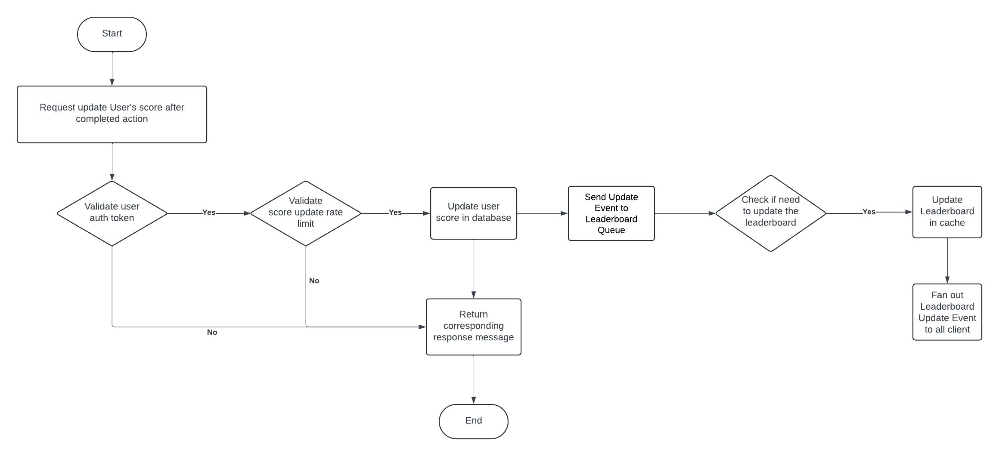

# User Score Manage and Leaderboard Module

This module provides the website’s scoreboard system, handling user score updates, and real-time leaderboard synchronization. Besides, we want the solution to strictly manage the score update to prevent malicious users from increasing scores without authorisation.

## Features

- **User score updates**: API endpoints to update and manage user scores.
- **Leaderboard retrieval**: API to fetch the top 10 user scores.
- **Real-time updates**: Notify clients when the leaderboard changes (via WebSocket or Server-Sent Events). Or simple solution like polling the API in period of time.
- **Authentication & authorization**: Secure endpoints to prevent tampering and unauthorized score manipulation.
- **Audit logging**: Record all score changes to detect abnormal or suspicious activity.

---

## 📂 API Specification

### 🔐 Authentication

- All endpoints require authentication (e.g., JWT or OAuth2 bearer tokens).
- Scores are tied to the authenticated user identity (the userId should be descrypt from the provided token).

---

### **1. Update Score**

`POST /api/v1/score/update`

Increment the score for the authenticated user after completing an action.

**Headers**

```http
Authorization: Bearer <token>
Content-Type: application/json
```

**Request Body**

```json
{
  "points": 5
}
```

**Response**

```json
{
  "success": true,
  "newScore": 120
}
```

---

### **2. Get Leaderboard**

`GET /api/v1/leaderboard`

Retrieve the top 10 scores.

**Response**

```json
{
  "leaderboard": [
    { "rank": 1, "username": "Alice", "score": 200 },
    { "rank": 2, "username": "Bob", "score": 190 }
  ]
}
```

---

### **3. Real-time Updates**

**Two solutions:**

- **Polling** – clients fetch `/api/v1/leaderboard/top` at fixed intervals.
- **WebSocket** – construct a WebSocket connection and send the notification when leaderboard changes. - Recalculate the leaderboard efficiently whenever a score changes.
  - Consider maintaining a separate **leaderboard table** to reduce stress on the main database.
  - Implement safeguards to prevent **inconsistent data** during concurrent write operations.
    **WebSocket Example**

```json
{
  "event": "leaderboardUpdate",
  "leaderboard": [
    { "rank": 1, "username": "Alice", "score": 210 },
    { "rank": 2, "username": "Bob", "score": 190 }
  ]
}
```

---

## Execution Flow Diagram



---

## Additional Comments & Improvements

- **Rate Limiting**: prevent abuse by limiting the frequency of score updates per user.
- **Monitoring & Alerts**: detect unusual score jumps through anomaly monitoring.
- **Caching**: use Redis or a similar solution for faster leaderboard retrieval.
- **Inconsistent Data**: concurrent write operations may cause overwrites and inconsistent state.
  - Consider using a **queue** or similar mechanism to control the update flow and ensure consistency.
- **Outdated Data** – To prevent stale information, schedule a cron job that regularly refreshes the leaderboard based on the latest database records.

---
